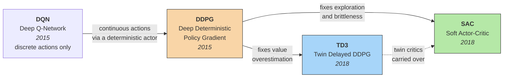
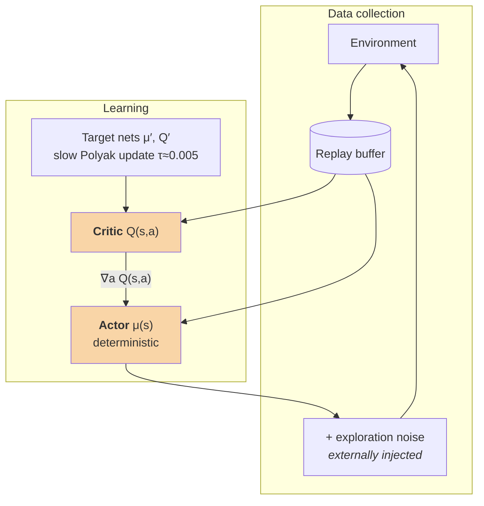
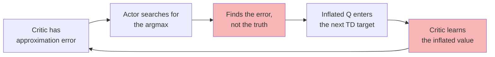
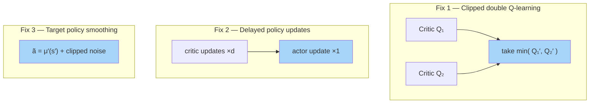

Most tutorials present **DDPG**, **TD3**, and **SAC** as three separate continuous-control algorithms you choose between. That framing hides the useful part.

They are better read as **one algorithm and two rounds of debugging**. Each successor exists because someone diagnosed a specific, nameable failure in its predecessor and fixed it.

<div class="alert alert-info" role="alert" markdown="1">
**The abbreviations, once:**

- **RL** — Reinforcement Learning
- **DQN** — Deep Q-Network
- **DPG** — Deterministic Policy Gradient
- **DDPG** — Deep Deterministic Policy Gradient
- **TD3** — Twin Delayed Deep Deterministic Policy Gradient
- **SAC** — Soft Actor-Critic
- **TD** — Temporal Difference (as in "TD target")
- **MPC** — Model Predictive Control
</div>

---

## The lineage at a glance



TD3 and SAC are **not competitors**. They are two different diagnoses of the same patient — and SAC happens to have taken the other one's medicine too.

---

## 1. DDPG — the original bet

**Deep Deterministic Policy Gradient** (Lillicrap et al., 2015) took DQN's machinery — replay buffer, target networks — and made it work for *continuous* actions.

<div class="alert alert-secondary" role="alert" markdown="1">
**The problem it solves.** DQN picks actions with `argmax_a Q(s,a)`. That is intractable when `a` is a vector of real numbers — you can't enumerate a continuum. DDPG's answer: train a **deterministic actor** `μ(s)` to output the action the critic likes best, and update it along `∇_a Q(s,a)`.
</div>



The TD target is

$$ y = r + \gamma\, Q'\big(s',\, \mu'(s')\big) $$

It works. It also has a reputation for being miserable to tune, and that reputation is deserved.

---

## 2. What actually goes wrong in DDPG

Two failures, and they compound.

### Failure A — Overestimation bias



The TD target contains an implicit maximization. Approximation error is noise on top of the true value, and taking a near-maximum over a noisy estimate is **biased upward**. That inflated value feeds the next target. The bias doesn't wash out — it accumulates.

<div class="alert alert-warning" role="alert" markdown="1">
**You can watch this happen.** Log the critic's predicted `Q(s,a)` against the discounted return actually achieved from that state. In a failing run the prediction drifts steadily above the truth and never comes back.
</div>

**Toggle the traces in the legend below** — hide "critic (overestimating)" and the healthy run looks unremarkable. That's exactly why this failure goes unnoticed if you only plot returns.

```plotly
{
  "data": [
    {
      "x": [0,20,40,60,80,100,120,140,160,180,200,220,240,260,280,300],
      "y": [0,11.3,19.5,25.3,29.5,32.4,34.6,36.1,37.2,38.0,38.6,39.0,39.3,39.5,39.6,39.7],
      "type": "scatter", "mode": "lines", "name": "realized return (truth)",
      "line": {"color": "#222", "width": 3}
    },
    {
      "x": [0,20,40,60,80,100,120,140,160,180,200,220,240,260,280,300],
      "y": [1.2,11.9,18.7,26.1,28.9,33.1,34.0,35.6,38.0,37.4,39.2,38.3,39.9,39.1,40.2,39.5],
      "type": "scatter", "mode": "lines+markers", "name": "critic (healthy)",
      "line": {"color": "#2a9d5c", "width": 2, "dash": "dot"}
    },
    {
      "x": [0,20,40,60,80,100,120,140,160,180,200,220,240,260,280,300],
      "y": [0.8,13.9,24.7,33.1,39.9,45.4,50.2,54.3,58.0,61.4,64.6,67.6,70.5,73.3,76.0,78.7],
      "type": "scatter", "mode": "lines+markers", "name": "critic (overestimating)",
      "line": {"color": "#c0392b", "width": 2, "dash": "dash"}
    }
  ],
  "layout": {
    "title": {"text": "Critic prediction vs. realized return"},
    "xaxis": {"title": {"text": "training step (thousands)"}},
    "yaxis": {"title": {"text": "value"}},
    "hovermode": "x unified",
    "margin": {"t": 50, "r": 20, "b": 50, "l": 60},
    "legend": {"orientation": "h", "y": -0.25}
  }
}
```

### Failure B — The actor exploits the critic's errors

The actor's entire job is to find the argmax of the critic. If the critic has a spurious bump — a region of action space it wrongly rates highly, usually because it has little data there — the actor will find it and go there.

This is adversarial in a way that's easy to miss: **the actor is optimizing against the critic's mistakes.**

Add a deterministic policy whose exploration comes entirely from externally injected noise, and you have something very sensitive to the noise schedule, the learning rates, and the random seed.

---

## 3. TD3 — three fixes for the bias

**Twin Delayed Deep Deterministic Policy Gradient** (Fujimoto, van Hoof & Meger, 2018). The paper's title is refreshingly literal: *Addressing Function Approximation Error in Actor-Critic Methods*.



| Fix | What it does | Why it works |
| --- | --- | --- |
| **Clipped double Q-learning** | Two critics; target uses the smaller | Underestimation doesn't compound — an underrated action just isn't selected, so it never poisons future targets |
| **Delayed policy updates** | Actor updated once per `d` critic updates (`d = 2`) | An actor chasing a moving critic chases noise. Let the value settle first |
| **Target policy smoothing** | Noise added to the target action | Enforces "nearby actions have similar values," flattening the narrow spurious peaks the actor would exploit |

The TD target becomes

$$ y = r + \gamma \min_{i=1,2} Q_i'(s', \tilde a), \qquad \tilde a = \mu'(s') + \varepsilon, \quad \varepsilon \sim \mathrm{clip}\big(\mathcal N(0,\sigma), -c, c\big) $$

<div class="alert alert-secondary" role="alert" markdown="1">
**A control-theory reading of Fix 2.** Delayed policy updates are timescale separation — the inner loop (value estimation) should converge faster than the outer loop (policy improvement). The same instinct appears throughout adaptive control.
</div>

TD3 is substantially more stable than DDPG. But exploration is still **extrinsic** — you're still hand-tuning an external noise process, and the policy is still deterministic.

---

## 4. SAC — change the objective instead

**Soft Actor-Critic** (Haarnoja et al., 2018) attacks from a different direction. Rather than patching a deterministic policy, it changes what "optimal" means.

$$ J(\pi) = \sum_t \mathbb{E}\Big[\, r(s_t, a_t) \;+\; \alpha\, \mathcal{H}\big(\pi(\cdot \mid s_t)\big) \Big] $$

The agent is now rewarded for **acting as randomly as it can while still doing well**.

### Move the slider

This is the part no static figure explains well. Below, a critic has two optima: a **broad, genuine** one near `a = +0.3`, and a **narrow, spurious spike** near `a = −0.6` — the kind of artifact a critic invents where it has little data.

Drag `α` and watch what the policy does.

- **`α → 0`** — the policy collapses onto the tallest point, spike included. This is DDPG's failure mode.
- **`α` moderate** — the policy prefers the broad optimum, because broad regions carry more entropy for the same value.
- **`α` large** — the task reward stops mattering and the policy spreads out aimlessly.

<div class="al-marimo-inline">

```python
import marimo as mo

alpha = mo.ui.slider(
    start=0.02, stop=1.5, step=0.02, value=0.20,
    label="temperature α", show_value=True,
)
alpha
```

```python
import numpy as np
import matplotlib.pyplot as plt

a = np.linspace(-1.0, 1.0, 600)

# critic landscape: one broad genuine optimum, one narrow spurious spike
Q = 1.00 * np.exp(-((a - 0.30) ** 2) / 0.090) \
  + 1.12 * np.exp(-((a + 0.60) ** 2) / 0.0022)

# Boltzmann (soft) policy induced by the temperature
z = Q / alpha.value
z = z - z.max()
pi = np.exp(z)
pi = pi / np.trapz(pi, a)

entropy = float(-np.trapz(pi * np.log(pi + 1e-12), a))
a_mode = float(a[int(np.argmax(pi))])
label = "broad optimum" if a_mode > 0 else "spurious spike"

fig, ax = plt.subplots(figsize=(7.5, 3.6))
ax.plot(a, Q, color="#222", lw=2.2, label="critic  Q(s,a)")
ax.fill_between(a, 0, pi / pi.max() * Q.max(), color="#2a9d5c",
                alpha=0.35, label="policy  π(a|s)")
ax.axvline(a_mode, color="#c0392b", ls="--", lw=1.6)
ax.set_xlabel("action  a")
ax.set_ylabel("value  /  density (scaled)")
ax.set_ylim(0, Q.max() * 1.15)
ax.legend(loc="upper left", fontsize=9)
ax.grid(alpha=0.25)
ax.set_title("policy mode at a = " + format(a_mode, ".2f") + "  (" + label + ")"
             + "   |   entropy H = " + format(entropy, ".2f"))
fig
```

</div>

Three consequences, all downstream of that single change to the objective:

**Exploration becomes intrinsic.** No injected noise, no schedule. The policy stays stochastic because staying stochastic *is worth reward*. Where several actions are near-equally good, SAC keeps its options open instead of committing prematurely.

**Brittleness drops.** A stochastic policy can't balance on a razor-thin spike — as the slider shows, the entropy term actively prefers the broad optimum. Broad optima generalize better and survive small model mismatch, which matters enormously when you eventually deploy on hardware that isn't your simulator.

**The temperature `α` becomes the knob that matters.** Too high and the policy is aimlessly random; too low and you are back to a deterministic policy with all of DDPG's problems.

<div class="alert alert-success" role="alert" markdown="1">
**Use the auto-tuning version.** The 2019 follow-up makes `α` adjust itself: you specify a target entropy (commonly `−dim(A)`, i.e. minus the action-space dimension) and `α` is tuned by dual gradient descent to hit it. There is no good reason to tune it by hand.
</div>

SAC also keeps TD3's twin critics with the `min`. The bias problem didn't go away — it is orthogonal to the entropy idea.

---

## 5. Side by side

| | **DDPG** | **TD3** | **SAC** |
| --- | --- | --- | --- |
| Full name | Deep Deterministic Policy Gradient | Twin Delayed DDPG | Soft Actor-Critic |
| Policy | deterministic | deterministic | **stochastic** |
| Exploration | injected noise | injected noise | **intrinsic (entropy)** |
| Critics | 1 | **2, take min** | **2, take min** |
| Actor update | every step | **every `d` steps** | every step |
| Target smoothing | — | **yes** | implicit (stochastic policy) |
| Main tuning burden | noise schedule, learning rates | noise schedule | temperature `α` (auto-tunable) |
| Robustness to seed | low | medium | **high** |

**The one-sentence version:** TD3 fixes DDPG's *value estimation*; SAC fixes DDPG's *exploration and brittleness*, and inherits TD3's value fix along the way.

---

## 6. A practitioner's note

I used SAC as one component of a [hybrid controller for vehicle lateral control](https://arxiv.org/abs/2608.17258), blending a learned policy with a constrained **MPC** (Model Predictive Control). Four things I would tell my earlier self:

<div class="alert alert-danger" role="alert" markdown="1">
**Report multiple seeds or don't report.** Single-seed continuous-control results are close to meaningless. My published numbers are mean ± standard deviation over five training seeds, and the spread was wide enough that any single run would have told a misleading story. This is the most common flaw in the RL results I read.
</div>

**SAC's stability doesn't transfer to your reward function.** SAC is robust to hyperparameters in a way DDPG isn't. It is *not* robust to a reward that accidentally makes a degenerate behavior optimal. Most of my debugging time went into the reward, not the algorithm.

**Watch the entropy, not just the return.** Two failure modes look identical on a return curve:

| Symptom | Likely cause |
| --- | --- |
| Entropy collapses to ~0 early | `α` too low — you've quietly reverted to a deterministic policy |
| Entropy stays pinned high | Task reward isn't outweighing the entropy bonus |

Drag the slider above to either extreme and you can see both failures directly.

**Understand what "it works" means before deploying.** SAC gave the best tracking error in my comparison. It also gives **no guarantee whatsoever** about what it will command in a state it hasn't seen. That gap — between *best average performance* and *acceptable worst case* — is the entire reason for pairing it with a model-based controller.

That's the next post.

---

## References

- Lillicrap et al., *Continuous Control with Deep Reinforcement Learning*, ICLR 2016 — DDPG. [arXiv:1509.02971](https://arxiv.org/abs/1509.02971)
- Fujimoto, van Hoof & Meger, *Addressing Function Approximation Error in Actor-Critic Methods*, ICML 2018 — TD3. [arXiv:1802.09477](https://arxiv.org/abs/1802.09477)
- Haarnoja et al., *Soft Actor-Critic: Off-Policy Maximum Entropy Deep Reinforcement Learning with a Stochastic Actor*, ICML 2018 — SAC. [arXiv:1801.01290](https://arxiv.org/abs/1801.01290)
- Haarnoja et al., *Soft Actor-Critic Algorithms and Applications*, 2019 — automatic temperature tuning. [arXiv:1812.05905](https://arxiv.org/abs/1812.05905)
