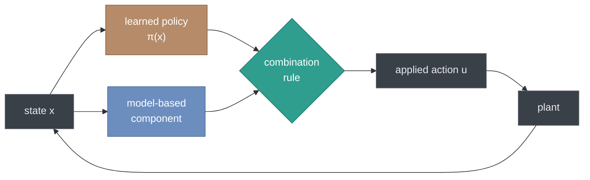
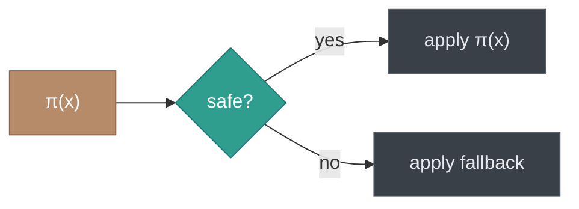

A deep reinforcement learning policy will out-track a hand-tuned controller on the scenarios it was trained on. It will also, in a situation it has never seen, command whatever its weights happen to produce — and you have no statement to make about what that will be.

Model predictive control gives you the statement. It also gives you a controller that is only as good as the model inside it.

This is usually presented as a choice. In practice, nobody chooses: the literature is full of architectures that use both. What varies is *how* they are combined, and the difference matters more than it first appears — because each combination preserves a different guarantee, and several preserve less than their authors' language suggests.

<div class="alert alert-info" role="alert" markdown="1">
**The abbreviations, once:**

- **RL** — Reinforcement Learning
- **MPC** — Model Predictive Control
- **SAC** — Soft Actor-Critic
- **QP** — Quadratic Program
- **CBF** — Control Barrier Function
- **RMSE** — Root Mean Square Error
</div>

<div class="alert alert-secondary" role="alert" markdown="1">
**Reading the visuals.** Diagrams are click-to-zoom — click once to enlarge, click the background or press <kbd>Esc</kbd> to reset. The interactive chart has a toolbar in its top-right corner on hover; the **house icon** resets the axes after you pan or zoom.
</div>

---

## The shape of the problem

Every combination strategy is answering the same question: *the learned policy has proposed an action — now what?*



The three strategies below differ only in that middle box. That is the whole design space, and it is worth being precise about what each choice costs.

---

## 1. Shields — veto the bad action

The oldest idea, and the easiest to reason about. A shield sits between the policy and the plant. It checks the proposed action against a safety condition; if the action fails, the shield substitutes a known-safe fallback.



**What it guarantees:** exactly what the safety condition encodes, and nothing else. If the condition is *"the commanded steering angle lies within the actuator range,"* you get that. If it is *"the vehicle remains inside a certified invariant set,"* you get that too — but only if you can actually compute such a set, which for a nonlinear vehicle model is the hard part of the entire problem.

**What it costs:** the fallback is a discontinuity. The policy is optimizing a trajectory; the shield interrupts it. Worse, if the policy learns *during* shielded operation, it receives a reward signal for actions it did not take, and the resulting credit assignment is subtly wrong.

Shields are honest and blunt. Their guarantee is a direct restatement of the condition you wrote down — which is a virtue, because it forces you to write one down.

---

## 2. Predictive safety filters — solve for the nearest safe action

More sophisticated, and now the dominant approach in the safe-RL literature. Instead of a binary veto, the filter solves an optimization problem at every step: find the action closest to what the policy proposed, subject to the constraint that a feasible safe trajectory exists from the resulting state.

$$u = \arg\min_{v} \; \lVert v - \pi(x) \rVert^2 \quad \text{subject to} \quad \text{a safe trajectory exists from } f(x, v)$$

In practice this is a QP solved over a prediction horizon, using the same machinery as MPC. Control barrier functions are one way to formulate the constraint; terminal invariant sets are another.

**What it guarantees:** this is where it gets genuinely strong — and where the fine print matters. If the underlying MPC problem is *recursively feasible* (a solution existing now implies a solution will exist next step) and you have a valid terminal set, you get constraint satisfaction for all future time. That is a real theorem, not a heuristic.

**What it costs:** the theorem's preconditions. Recursive feasibility requires a terminal invariant set, and computing one for a nonlinear model is difficult; many papers assume a linearized model and inherit the linearization's validity region without saying so. The QP must also solve within the control period, every period, including the worst case — and a safety filter that occasionally misses its deadline is not a safety filter.

The guarantee is excellent. The question to ask any paper claiming it is: *what were the preconditions, and did you verify them or assume them?*

---

## 3. Continuous blending — mix rather than override

The third option is to stop treating this as a decision. Rather than choosing between the policy's action and the model-based one, apply a weighted combination of both:

$$\delta = \mathrm{sat}_{\delta_{\max}}\big((1-\alpha)\,\delta_{\mathrm{MPC}}^{*} + \alpha\,\delta_{\mathrm{RL}}\big)$$

where $$\alpha \in [0, 1)$$ sets the mix. There is no veto and no switching — every command contains a contribution from both.

The parameterization matters. If $$\alpha$$ is exposed directly, a practitioner has to reason about a bounded quantity with awkward endpoints. Instead, expose a single unbounded knob $$\lambda \ge 0$$ and define

$$\alpha(\lambda) = \frac{\lambda}{1 + \lambda}$$

This is monotone, equals zero at $$\lambda = 0$$, and approaches but never reaches one. That last property is the useful one: **no finite $$\lambda$$ removes the model-based term.** The deterministic component cannot be tuned away by accident, only approached asymptotically.

### Move the slider

The chart below shows an initial-offset recovery. The dotted traces are what each controller would command alone; the solid trace is what actually reaches the actuator. Drag $$\lambda$$ and watch the applied command migrate from one to the other — and notice that it never leaves the dashed envelope.

<div class="alert alert-warning" role="alert" markdown="1">
These traces are illustrative, generated to show the blending mechanic. The measured results from the paper are in the table further down.
</div>

```plotly
{
 "data": [
  {
   "x": [
    0.0,
    0.1,
    0.2,
    0.3,
    0.4,
    0.5,
    0.6,
    0.7,
    0.8,
    0.9,
    1.0,
    1.1,
    1.2,
    1.3,
    1.4,
    1.5,
    1.6,
    1.7,
    1.8,
    1.9,
    2.0,
    2.1,
    2.2,
    2.3,
    2.4,
    2.5,
    2.6,
    2.7,
    2.8,
    2.9,
    3.0,
    3.1,
    3.2,
    3.3,
    3.4,
    3.5,
    3.6,
    3.7,
    3.8,
    3.9,
    4.0,
    4.1,
    4.2,
    4.3,
    4.4,
    4.5,
    4.6,
    4.7,
    4.8,
    4.9,
    5.0,
    5.1,
    5.2,
    5.3,
    5.4,
    5.5,
    5.6,
    5.7,
    5.8,
    5.9,
    6.0
   ],
   "y": [
    0.0051,
    0.00476,
    0.00437,
    0.00394,
    0.00348,
    0.00301,
    0.00252,
    0.00203,
    0.00155,
    0.00109,
    0.00065,
    0.00023,
    -0.00016,
    -0.00052,
    -0.00084,
    -0.00112,
    -0.00136,
    -0.00157,
    -0.00174,
    -0.00188,
    -0.00198,
    -0.00205,
    -0.00208,
    -0.00209,
    -0.00207,
    -0.00203,
    -0.00197,
    -0.00189,
    -0.0018,
    -0.0017,
    -0.00158,
    -0.00146,
    -0.00134,
    -0.00121,
    -0.00108,
    -0.00096,
    -0.00084,
    -0.00072,
    -0.00061,
    -0.00051,
    -0.00041,
    -0.00032,
    -0.00024,
    -0.00017,
    -0.00011,
    -5e-05,
    -1e-05,
    3e-05,
    6e-05,
    8e-05,
    0.0001,
    0.0001,
    0.00011,
    0.00011,
    0.0001,
    9e-05,
    8e-05,
    6e-05,
    4e-05,
    2e-05,
    0.0
   ],
   "type": "scatter",
   "mode": "lines",
   "name": "\u03b4_MPC  (model-based)",
   "line": {
    "color": "#6c8ebf",
    "width": 2,
    "dash": "dot"
   },
   "hovertemplate": "MPC: %{y:.4f} rad<extra></extra>"
  },
  {
   "x": [
    0.0,
    0.1,
    0.2,
    0.3,
    0.4,
    0.5,
    0.6,
    0.7,
    0.8,
    0.9,
    1.0,
    1.1,
    1.2,
    1.3,
    1.4,
    1.5,
    1.6,
    1.7,
    1.8,
    1.9,
    2.0,
    2.1,
    2.2,
    2.3,
    2.4,
    2.5,
    2.6,
    2.7,
    2.8,
    2.9,
    3.0,
    3.1,
    3.2,
    3.3,
    3.4,
    3.5,
    3.6,
    3.7,
    3.8,
    3.9,
    4.0,
    4.1,
    4.2,
    4.3,
    4.4,
    4.5,
    4.6,
    4.7,
    4.8,
    4.9,
    5.0,
    5.1,
    5.2,
    5.3,
    5.4,
    5.5,
    5.6,
    5.7,
    5.8,
    5.9,
    6.0
   ],
   "y": [
    0.0113,
    0.00964,
    0.00789,
    0.00613,
    0.00446,
    0.00292,
    0.00156,
    0.00041,
    -0.00051,
    -0.00122,
    -0.00171,
    -0.00201,
    -0.00215,
    -0.00215,
    -0.00205,
    -0.00187,
    -0.00164,
    -0.00139,
    -0.00113,
    -0.00089,
    -0.00068,
    -0.0005,
    -0.00036,
    -0.00025,
    -0.00018,
    -0.00014,
    -0.00012,
    -0.00012,
    -0.00013,
    -0.00013,
    -0.00014,
    -0.00013,
    -0.00012,
    -9e-05,
    -6e-05,
    -1e-05,
    4e-05,
    0.0001,
    0.00016,
    0.00021,
    0.00026,
    0.0003,
    0.00032,
    0.00033,
    0.00033,
    0.00031,
    0.00028,
    0.00023,
    0.00018,
    0.00012,
    6e-05,
    0.0,
    -6e-05,
    -0.00011,
    -0.00015,
    -0.00018,
    -0.0002,
    -0.00021,
    -0.00021,
    -0.0002,
    -0.00018
   ],
   "type": "scatter",
   "mode": "lines",
   "name": "\u03b4_SAC  (learned)",
   "line": {
    "color": "#b58b6a",
    "width": 2,
    "dash": "dot"
   },
   "hovertemplate": "SAC: %{y:.4f} rad<extra></extra>"
  },
  {
   "x": [
    0.0,
    0.1,
    0.2,
    0.3,
    0.4,
    0.5,
    0.6,
    0.7,
    0.8,
    0.9,
    1.0,
    1.1,
    1.2,
    1.3,
    1.4,
    1.5,
    1.6,
    1.7,
    1.8,
    1.9,
    2.0,
    2.1,
    2.2,
    2.3,
    2.4,
    2.5,
    2.6,
    2.7,
    2.8,
    2.9,
    3.0,
    3.1,
    3.2,
    3.3,
    3.4,
    3.5,
    3.6,
    3.7,
    3.8,
    3.9,
    4.0,
    4.1,
    4.2,
    4.3,
    4.4,
    4.5,
    4.6,
    4.7,
    4.8,
    4.9,
    5.0,
    5.1,
    5.2,
    5.3,
    5.4,
    5.5,
    5.6,
    5.7,
    5.8,
    5.9,
    6.0
   ],
   "y": [
    0.0051,
    0.00476,
    0.00437,
    0.00394,
    0.00348,
    0.00301,
    0.00252,
    0.00203,
    0.00155,
    0.00109,
    0.00065,
    0.00023,
    -0.00016,
    -0.00052,
    -0.00084,
    -0.00112,
    -0.00136,
    -0.00157,
    -0.00174,
    -0.00188,
    -0.00198,
    -0.00205,
    -0.00208,
    -0.00209,
    -0.00207,
    -0.00203,
    -0.00197,
    -0.00189,
    -0.0018,
    -0.0017,
    -0.00158,
    -0.00146,
    -0.00134,
    -0.00121,
    -0.00108,
    -0.00096,
    -0.00084,
    -0.00072,
    -0.00061,
    -0.00051,
    -0.00041,
    -0.00032,
    -0.00024,
    -0.00017,
    -0.00011,
    -5e-05,
    -1e-05,
    3e-05,
    6e-05,
    8e-05,
    0.0001,
    0.0001,
    0.00011,
    0.00011,
    0.0001,
    9e-05,
    8e-05,
    6e-05,
    4e-05,
    2e-05,
    0.0
   ],
   "type": "scatter",
   "mode": "lines",
   "name": "\u03b4 applied  (blend)",
   "line": {
    "color": "#2f9e8f",
    "width": 4
   },
   "hovertemplate": "applied: %{y:.4f} rad<extra></extra>"
  },
  {
   "x": [
    0.0,
    0.1,
    0.2,
    0.3,
    0.4,
    0.5,
    0.6,
    0.7,
    0.8,
    0.9,
    1.0,
    1.1,
    1.2,
    1.3,
    1.4,
    1.5,
    1.6,
    1.7,
    1.8,
    1.9,
    2.0,
    2.1,
    2.2,
    2.3,
    2.4,
    2.5,
    2.6,
    2.7,
    2.8,
    2.9,
    3.0,
    3.1,
    3.2,
    3.3,
    3.4,
    3.5,
    3.6,
    3.7,
    3.8,
    3.9,
    4.0,
    4.1,
    4.2,
    4.3,
    4.4,
    4.5,
    4.6,
    4.7,
    4.8,
    4.9,
    5.0,
    5.1,
    5.2,
    5.3,
    5.4,
    5.5,
    5.6,
    5.7,
    5.8,
    5.9,
    6.0
   ],
   "y": [
    0.01,
    0.01,
    0.01,
    0.01,
    0.01,
    0.01,
    0.01,
    0.01,
    0.01,
    0.01,
    0.01,
    0.01,
    0.01,
    0.01,
    0.01,
    0.01,
    0.01,
    0.01,
    0.01,
    0.01,
    0.01,
    0.01,
    0.01,
    0.01,
    0.01,
    0.01,
    0.01,
    0.01,
    0.01,
    0.01,
    0.01,
    0.01,
    0.01,
    0.01,
    0.01,
    0.01,
    0.01,
    0.01,
    0.01,
    0.01,
    0.01,
    0.01,
    0.01,
    0.01,
    0.01,
    0.01,
    0.01,
    0.01,
    0.01,
    0.01,
    0.01,
    0.01,
    0.01,
    0.01,
    0.01,
    0.01,
    0.01,
    0.01,
    0.01,
    0.01,
    0.01
   ],
   "type": "scatter",
   "mode": "lines",
   "name": "\u00b1\u03b4_max  (actuator bound)",
   "line": {
    "color": "#c0554e",
    "width": 1.5,
    "dash": "dash"
   },
   "hoverinfo": "skip"
  },
  {
   "x": [
    0.0,
    0.1,
    0.2,
    0.3,
    0.4,
    0.5,
    0.6,
    0.7,
    0.8,
    0.9,
    1.0,
    1.1,
    1.2,
    1.3,
    1.4,
    1.5,
    1.6,
    1.7,
    1.8,
    1.9,
    2.0,
    2.1,
    2.2,
    2.3,
    2.4,
    2.5,
    2.6,
    2.7,
    2.8,
    2.9,
    3.0,
    3.1,
    3.2,
    3.3,
    3.4,
    3.5,
    3.6,
    3.7,
    3.8,
    3.9,
    4.0,
    4.1,
    4.2,
    4.3,
    4.4,
    4.5,
    4.6,
    4.7,
    4.8,
    4.9,
    5.0,
    5.1,
    5.2,
    5.3,
    5.4,
    5.5,
    5.6,
    5.7,
    5.8,
    5.9,
    6.0
   ],
   "y": [
    -0.01,
    -0.01,
    -0.01,
    -0.01,
    -0.01,
    -0.01,
    -0.01,
    -0.01,
    -0.01,
    -0.01,
    -0.01,
    -0.01,
    -0.01,
    -0.01,
    -0.01,
    -0.01,
    -0.01,
    -0.01,
    -0.01,
    -0.01,
    -0.01,
    -0.01,
    -0.01,
    -0.01,
    -0.01,
    -0.01,
    -0.01,
    -0.01,
    -0.01,
    -0.01,
    -0.01,
    -0.01,
    -0.01,
    -0.01,
    -0.01,
    -0.01,
    -0.01,
    -0.01,
    -0.01,
    -0.01,
    -0.01,
    -0.01,
    -0.01,
    -0.01,
    -0.01,
    -0.01,
    -0.01,
    -0.01,
    -0.01,
    -0.01,
    -0.01,
    -0.01,
    -0.01,
    -0.01,
    -0.01,
    -0.01,
    -0.01,
    -0.01,
    -0.01,
    -0.01,
    -0.01
   ],
   "type": "scatter",
   "mode": "lines",
   "showlegend": false,
   "line": {
    "color": "#c0554e",
    "width": 1.5,
    "dash": "dash"
   },
   "hoverinfo": "skip"
  }
 ],
 "layout": {
  "title": {
   "text": "\u03bb = 0   \u2192   \u03b1 = 0.00   \u00b7   pure MPC"
  },
  "xaxis": {
   "title": {
    "text": "time  [s]"
   },
   "zeroline": false
  },
  "yaxis": {
   "title": {
    "text": "steering angle \u03b4  [rad]"
   },
   "range": [
    -0.0145,
    0.0145
   ],
   "zeroline": true
  },
  "height": 540,
  "margin": {
   "l": 70,
   "r": 30,
   "t": 105,
   "b": 130
  },
  "legend": {
   "orientation": "h",
   "y": 1.06,
   "x": 0,
   "xanchor": "left",
   "yanchor": "bottom"
  },
  "sliders": [
   {
    "active": 0,
    "y": -0.22,
    "x": 0.06,
    "len": 0.88,
    "currentvalue": {
     "prefix": "\u03bb = ",
     "visible": true,
     "xanchor": "left"
    },
    "pad": {
     "t": 40,
     "b": 10
    },
    "steps": [
     {
      "method": "update",
      "label": "0",
      "args": [
       {
        "y": [
         [
          0.0051,
          0.00476,
          0.00437,
          0.00394,
          0.00348,
          0.00301,
          0.00252,
          0.00203,
          0.00155,
          0.00109,
          0.00065,
          0.00023,
          -0.00016,
          -0.00052,
          -0.00084,
          -0.00112,
          -0.00136,
          -0.00157,
          -0.00174,
          -0.00188,
          -0.00198,
          -0.00205,
          -0.00208,
          -0.00209,
          -0.00207,
          -0.00203,
          -0.00197,
          -0.00189,
          -0.0018,
          -0.0017,
          -0.00158,
          -0.00146,
          -0.00134,
          -0.00121,
          -0.00108,
          -0.00096,
          -0.00084,
          -0.00072,
          -0.00061,
          -0.00051,
          -0.00041,
          -0.00032,
          -0.00024,
          -0.00017,
          -0.00011,
          -5e-05,
          -1e-05,
          3e-05,
          6e-05,
          8e-05,
          0.0001,
          0.0001,
          0.00011,
          0.00011,
          0.0001,
          9e-05,
          8e-05,
          6e-05,
          4e-05,
          2e-05,
          0.0
         ],
         [
          0.0113,
          0.00964,
          0.00789,
          0.00613,
          0.00446,
          0.00292,
          0.00156,
          0.00041,
          -0.00051,
          -0.00122,
          -0.00171,
          -0.00201,
          -0.00215,
          -0.00215,
          -0.00205,
          -0.00187,
          -0.00164,
          -0.00139,
          -0.00113,
          -0.00089,
          -0.00068,
          -0.0005,
          -0.00036,
          -0.00025,
          -0.00018,
          -0.00014,
          -0.00012,
          -0.00012,
          -0.00013,
          -0.00013,
          -0.00014,
          -0.00013,
          -0.00012,
          -9e-05,
          -6e-05,
          -1e-05,
          4e-05,
          0.0001,
          0.00016,
          0.00021,
          0.00026,
          0.0003,
          0.00032,
          0.00033,
          0.00033,
          0.00031,
          0.00028,
          0.00023,
          0.00018,
          0.00012,
          6e-05,
          0.0,
          -6e-05,
          -0.00011,
          -0.00015,
          -0.00018,
          -0.0002,
          -0.00021,
          -0.00021,
          -0.0002,
          -0.00018
         ],
         [
          0.0051,
          0.00476,
          0.00437,
          0.00394,
          0.00348,
          0.00301,
          0.00252,
          0.00203,
          0.00155,
          0.00109,
          0.00065,
          0.00023,
          -0.00016,
          -0.00052,
          -0.00084,
          -0.00112,
          -0.00136,
          -0.00157,
          -0.00174,
          -0.00188,
          -0.00198,
          -0.00205,
          -0.00208,
          -0.00209,
          -0.00207,
          -0.00203,
          -0.00197,
          -0.00189,
          -0.0018,
          -0.0017,
          -0.00158,
          -0.00146,
          -0.00134,
          -0.00121,
          -0.00108,
          -0.00096,
          -0.00084,
          -0.00072,
          -0.00061,
          -0.00051,
          -0.00041,
          -0.00032,
          -0.00024,
          -0.00017,
          -0.00011,
          -5e-05,
          -1e-05,
          3e-05,
          6e-05,
          8e-05,
          0.0001,
          0.0001,
          0.00011,
          0.00011,
          0.0001,
          9e-05,
          8e-05,
          6e-05,
          4e-05,
          2e-05,
          0.0
         ],
         [
          0.01,
          0.01,
          0.01,
          0.01,
          0.01,
          0.01,
          0.01,
          0.01,
          0.01,
          0.01,
          0.01,
          0.01,
          0.01,
          0.01,
          0.01,
          0.01,
          0.01,
          0.01,
          0.01,
          0.01,
          0.01,
          0.01,
          0.01,
          0.01,
          0.01,
          0.01,
          0.01,
          0.01,
          0.01,
          0.01,
          0.01,
          0.01,
          0.01,
          0.01,
          0.01,
          0.01,
          0.01,
          0.01,
          0.01,
          0.01,
          0.01,
          0.01,
          0.01,
          0.01,
          0.01,
          0.01,
          0.01,
          0.01,
          0.01,
          0.01,
          0.01,
          0.01,
          0.01,
          0.01,
          0.01,
          0.01,
          0.01,
          0.01,
          0.01,
          0.01,
          0.01
         ],
         [
          -0.01,
          -0.01,
          -0.01,
          -0.01,
          -0.01,
          -0.01,
          -0.01,
          -0.01,
          -0.01,
          -0.01,
          -0.01,
          -0.01,
          -0.01,
          -0.01,
          -0.01,
          -0.01,
          -0.01,
          -0.01,
          -0.01,
          -0.01,
          -0.01,
          -0.01,
          -0.01,
          -0.01,
          -0.01,
          -0.01,
          -0.01,
          -0.01,
          -0.01,
          -0.01,
          -0.01,
          -0.01,
          -0.01,
          -0.01,
          -0.01,
          -0.01,
          -0.01,
          -0.01,
          -0.01,
          -0.01,
          -0.01,
          -0.01,
          -0.01,
          -0.01,
          -0.01,
          -0.01,
          -0.01,
          -0.01,
          -0.01,
          -0.01,
          -0.01,
          -0.01,
          -0.01,
          -0.01,
          -0.01,
          -0.01,
          -0.01,
          -0.01,
          -0.01,
          -0.01,
          -0.01
         ]
        ]
       },
       {
        "title": {
         "text": "\u03bb = 0   \u2192   \u03b1 = 0.00   \u00b7   pure MPC"
        }
       }
      ]
     },
     {
      "method": "update",
      "label": "0.25",
      "args": [
       {
        "y": [
         [
          0.0051,
          0.00476,
          0.00437,
          0.00394,
          0.00348,
          0.00301,
          0.00252,
          0.00203,
          0.00155,
          0.00109,
          0.00065,
          0.00023,
          -0.00016,
          -0.00052,
          -0.00084,
          -0.00112,
          -0.00136,
          -0.00157,
          -0.00174,
          -0.00188,
          -0.00198,
          -0.00205,
          -0.00208,
          -0.00209,
          -0.00207,
          -0.00203,
          -0.00197,
          -0.00189,
          -0.0018,
          -0.0017,
          -0.00158,
          -0.00146,
          -0.00134,
          -0.00121,
          -0.00108,
          -0.00096,
          -0.00084,
          -0.00072,
          -0.00061,
          -0.00051,
          -0.00041,
          -0.00032,
          -0.00024,
          -0.00017,
          -0.00011,
          -5e-05,
          -1e-05,
          3e-05,
          6e-05,
          8e-05,
          0.0001,
          0.0001,
          0.00011,
          0.00011,
          0.0001,
          9e-05,
          8e-05,
          6e-05,
          4e-05,
          2e-05,
          0.0
         ],
         [
          0.0113,
          0.00964,
          0.00789,
          0.00613,
          0.00446,
          0.00292,
          0.00156,
          0.00041,
          -0.00051,
          -0.00122,
          -0.00171,
          -0.00201,
          -0.00215,
          -0.00215,
          -0.00205,
          -0.00187,
          -0.00164,
          -0.00139,
          -0.00113,
          -0.00089,
          -0.00068,
          -0.0005,
          -0.00036,
          -0.00025,
          -0.00018,
          -0.00014,
          -0.00012,
          -0.00012,
          -0.00013,
          -0.00013,
          -0.00014,
          -0.00013,
          -0.00012,
          -9e-05,
          -6e-05,
          -1e-05,
          4e-05,
          0.0001,
          0.00016,
          0.00021,
          0.00026,
          0.0003,
          0.00032,
          0.00033,
          0.00033,
          0.00031,
          0.00028,
          0.00023,
          0.00018,
          0.00012,
          6e-05,
          0.0,
          -6e-05,
          -0.00011,
          -0.00015,
          -0.00018,
          -0.0002,
          -0.00021,
          -0.00021,
          -0.0002,
          -0.00018
         ],
         [
          0.00634,
          0.00574,
          0.00507,
          0.00438,
          0.00368,
          0.00299,
          0.00233,
          0.00171,
          0.00114,
          0.00063,
          0.00018,
          -0.00022,
          -0.00056,
          -0.00085,
          -0.00108,
          -0.00127,
          -0.00142,
          -0.00153,
          -0.00162,
          -0.00168,
          -0.00172,
          -0.00174,
          -0.00174,
          -0.00172,
          -0.00169,
          -0.00165,
          -0.0016,
          -0.00154,
          -0.00147,
          -0.00139,
          -0.00129,
          -0.00119,
          -0.0011,
          -0.00099,
          -0.00088,
          -0.00077,
          -0.00066,
          -0.00056,
          -0.00046,
          -0.00037,
          -0.00028,
          -0.0002,
          -0.00013,
          -7e-05,
          -2e-05,
          2e-05,
          5e-05,
          7e-05,
          8e-05,
          9e-05,
          9e-05,
          8e-05,
          8e-05,
          7e-05,
          5e-05,
          4e-05,
          2e-05,
          1e-05,
          -1e-05,
          -2e-05,
          -4e-05
         ],
         [
          0.01,
          0.01,
          0.01,
          0.01,
          0.01,
          0.01,
          0.01,
          0.01,
          0.01,
          0.01,
          0.01,
          0.01,
          0.01,
          0.01,
          0.01,
          0.01,
          0.01,
          0.01,
          0.01,
          0.01,
          0.01,
          0.01,
          0.01,
          0.01,
          0.01,
          0.01,
          0.01,
          0.01,
          0.01,
          0.01,
          0.01,
          0.01,
          0.01,
          0.01,
          0.01,
          0.01,
          0.01,
          0.01,
          0.01,
          0.01,
          0.01,
          0.01,
          0.01,
          0.01,
          0.01,
          0.01,
          0.01,
          0.01,
          0.01,
          0.01,
          0.01,
          0.01,
          0.01,
          0.01,
          0.01,
          0.01,
          0.01,
          0.01,
          0.01,
          0.01,
          0.01
         ],
         [
          -0.01,
          -0.01,
          -0.01,
          -0.01,
          -0.01,
          -0.01,
          -0.01,
          -0.01,
          -0.01,
          -0.01,
          -0.01,
          -0.01,
          -0.01,
          -0.01,
          -0.01,
          -0.01,
          -0.01,
          -0.01,
          -0.01,
          -0.01,
          -0.01,
          -0.01,
          -0.01,
          -0.01,
          -0.01,
          -0.01,
          -0.01,
          -0.01,
          -0.01,
          -0.01,
          -0.01,
          -0.01,
          -0.01,
          -0.01,
          -0.01,
          -0.01,
          -0.01,
          -0.01,
          -0.01,
          -0.01,
          -0.01,
          -0.01,
          -0.01,
          -0.01,
          -0.01,
          -0.01,
          -0.01,
          -0.01,
          -0.01,
          -0.01,
          -0.01,
          -0.01,
          -0.01,
          -0.01,
          -0.01,
          -0.01,
          -0.01,
          -0.01,
          -0.01,
          -0.01,
          -0.01
         ]
        ]
       },
       {
        "title": {
         "text": "\u03bb = 0.25   \u2192   \u03b1 = 0.20   \u00b7   blended"
        }
       }
      ]
     },
     {
      "method": "update",
      "label": "0.5",
      "args": [
       {
        "y": [
         [
          0.0051,
          0.00476,
          0.00437,
          0.00394,
          0.00348,
          0.00301,
          0.00252,
          0.00203,
          0.00155,
          0.00109,
          0.00065,
          0.00023,
          -0.00016,
          -0.00052,
          -0.00084,
          -0.00112,
          -0.00136,
          -0.00157,
          -0.00174,
          -0.00188,
          -0.00198,
          -0.00205,
          -0.00208,
          -0.00209,
          -0.00207,
          -0.00203,
          -0.00197,
          -0.00189,
          -0.0018,
          -0.0017,
          -0.00158,
          -0.00146,
          -0.00134,
          -0.00121,
          -0.00108,
          -0.00096,
          -0.00084,
          -0.00072,
          -0.00061,
          -0.00051,
          -0.00041,
          -0.00032,
          -0.00024,
          -0.00017,
          -0.00011,
          -5e-05,
          -1e-05,
          3e-05,
          6e-05,
          8e-05,
          0.0001,
          0.0001,
          0.00011,
          0.00011,
          0.0001,
          9e-05,
          8e-05,
          6e-05,
          4e-05,
          2e-05,
          0.0
         ],
         [
          0.0113,
          0.00964,
          0.00789,
          0.00613,
          0.00446,
          0.00292,
          0.00156,
          0.00041,
          -0.00051,
          -0.00122,
          -0.00171,
          -0.00201,
          -0.00215,
          -0.00215,
          -0.00205,
          -0.00187,
          -0.00164,
          -0.00139,
          -0.00113,
          -0.00089,
          -0.00068,
          -0.0005,
          -0.00036,
          -0.00025,
          -0.00018,
          -0.00014,
          -0.00012,
          -0.00012,
          -0.00013,
          -0.00013,
          -0.00014,
          -0.00013,
          -0.00012,
          -9e-05,
          -6e-05,
          -1e-05,
          4e-05,
          0.0001,
          0.00016,
          0.00021,
          0.00026,
          0.0003,
          0.00032,
          0.00033,
          0.00033,
          0.00031,
          0.00028,
          0.00023,
          0.00018,
          0.00012,
          6e-05,
          0.0,
          -6e-05,
          -0.00011,
          -0.00015,
          -0.00018,
          -0.0002,
          -0.00021,
          -0.00021,
          -0.0002,
          -0.00018
         ],
         [
          0.00717,
          0.00639,
          0.00554,
          0.00467,
          0.00381,
          0.00298,
          0.0022,
          0.00149,
          0.00086,
          0.00032,
          -0.00014,
          -0.00052,
          -0.00082,
          -0.00106,
          -0.00124,
          -0.00137,
          -0.00145,
          -0.00151,
          -0.00154,
          -0.00155,
          -0.00155,
          -0.00153,
          -0.00151,
          -0.00148,
          -0.00144,
          -0.0014,
          -0.00135,
          -0.0013,
          -0.00124,
          -0.00118,
          -0.0011,
          -0.00102,
          -0.00093,
          -0.00084,
          -0.00074,
          -0.00064,
          -0.00055,
          -0.00045,
          -0.00035,
          -0.00027,
          -0.00019,
          -0.00011,
          -5e-05,
          -0.0,
          4e-05,
          7e-05,
          9e-05,
          0.0001,
          0.0001,
          9e-05,
          9e-05,
          7e-05,
          5e-05,
          4e-05,
          2e-05,
          0.0,
          -1e-05,
          -3e-05,
          -4e-05,
          -5e-05,
          -6e-05
         ],
         [
          0.01,
          0.01,
          0.01,
          0.01,
          0.01,
          0.01,
          0.01,
          0.01,
          0.01,
          0.01,
          0.01,
          0.01,
          0.01,
          0.01,
          0.01,
          0.01,
          0.01,
          0.01,
          0.01,
          0.01,
          0.01,
          0.01,
          0.01,
          0.01,
          0.01,
          0.01,
          0.01,
          0.01,
          0.01,
          0.01,
          0.01,
          0.01,
          0.01,
          0.01,
          0.01,
          0.01,
          0.01,
          0.01,
          0.01,
          0.01,
          0.01,
          0.01,
          0.01,
          0.01,
          0.01,
          0.01,
          0.01,
          0.01,
          0.01,
          0.01,
          0.01,
          0.01,
          0.01,
          0.01,
          0.01,
          0.01,
          0.01,
          0.01,
          0.01,
          0.01,
          0.01
         ],
         [
          -0.01,
          -0.01,
          -0.01,
          -0.01,
          -0.01,
          -0.01,
          -0.01,
          -0.01,
          -0.01,
          -0.01,
          -0.01,
          -0.01,
          -0.01,
          -0.01,
          -0.01,
          -0.01,
          -0.01,
          -0.01,
          -0.01,
          -0.01,
          -0.01,
          -0.01,
          -0.01,
          -0.01,
          -0.01,
          -0.01,
          -0.01,
          -0.01,
          -0.01,
          -0.01,
          -0.01,
          -0.01,
          -0.01,
          -0.01,
          -0.01,
          -0.01,
          -0.01,
          -0.01,
          -0.01,
          -0.01,
          -0.01,
          -0.01,
          -0.01,
          -0.01,
          -0.01,
          -0.01,
          -0.01,
          -0.01,
          -0.01,
          -0.01,
          -0.01,
          -0.01,
          -0.01,
          -0.01,
          -0.01,
          -0.01,
          -0.01,
          -0.01,
          -0.01,
          -0.01,
          -0.01
         ]
        ]
       },
       {
        "title": {
         "text": "\u03bb = 0.5   \u2192   \u03b1 = 0.33   \u00b7   blended"
        }
       }
      ]
     },
     {
      "method": "update",
      "label": "1",
      "args": [
       {
        "y": [
         [
          0.0051,
          0.00476,
          0.00437,
          0.00394,
          0.00348,
          0.00301,
          0.00252,
          0.00203,
          0.00155,
          0.00109,
          0.00065,
          0.00023,
          -0.00016,
          -0.00052,
          -0.00084,
          -0.00112,
          -0.00136,
          -0.00157,
          -0.00174,
          -0.00188,
          -0.00198,
          -0.00205,
          -0.00208,
          -0.00209,
          -0.00207,
          -0.00203,
          -0.00197,
          -0.00189,
          -0.0018,
          -0.0017,
          -0.00158,
          -0.00146,
          -0.00134,
          -0.00121,
          -0.00108,
          -0.00096,
          -0.00084,
          -0.00072,
          -0.00061,
          -0.00051,
          -0.00041,
          -0.00032,
          -0.00024,
          -0.00017,
          -0.00011,
          -5e-05,
          -1e-05,
          3e-05,
          6e-05,
          8e-05,
          0.0001,
          0.0001,
          0.00011,
          0.00011,
          0.0001,
          9e-05,
          8e-05,
          6e-05,
          4e-05,
          2e-05,
          0.0
         ],
         [
          0.0113,
          0.00964,
          0.00789,
          0.00613,
          0.00446,
          0.00292,
          0.00156,
          0.00041,
          -0.00051,
          -0.00122,
          -0.00171,
          -0.00201,
          -0.00215,
          -0.00215,
          -0.00205,
          -0.00187,
          -0.00164,
          -0.00139,
          -0.00113,
          -0.00089,
          -0.00068,
          -0.0005,
          -0.00036,
          -0.00025,
          -0.00018,
          -0.00014,
          -0.00012,
          -0.00012,
          -0.00013,
          -0.00013,
          -0.00014,
          -0.00013,
          -0.00012,
          -9e-05,
          -6e-05,
          -1e-05,
          4e-05,
          0.0001,
          0.00016,
          0.00021,
          0.00026,
          0.0003,
          0.00032,
          0.00033,
          0.00033,
          0.00031,
          0.00028,
          0.00023,
          0.00018,
          0.00012,
          6e-05,
          0.0,
          -6e-05,
          -0.00011,
          -0.00015,
          -0.00018,
          -0.0002,
          -0.00021,
          -0.00021,
          -0.0002,
          -0.00018
         ],
         [
          0.0082,
          0.0072,
          0.00613,
          0.00503,
          0.00397,
          0.00296,
          0.00204,
          0.00122,
          0.00052,
          -6e-05,
          -0.00053,
          -0.00089,
          -0.00115,
          -0.00134,
          -0.00145,
          -0.00149,
          -0.0015,
          -0.00148,
          -0.00144,
          -0.00138,
          -0.00133,
          -0.00128,
          -0.00122,
          -0.00117,
          -0.00112,
          -0.00109,
          -0.00104,
          -0.00101,
          -0.00096,
          -0.00091,
          -0.00086,
          -0.00079,
          -0.00073,
          -0.00065,
          -0.00057,
          -0.00049,
          -0.0004,
          -0.00031,
          -0.00022,
          -0.00015,
          -8e-05,
          -1e-05,
          4e-05,
          8e-05,
          0.00011,
          0.00013,
          0.00013,
          0.00013,
          0.00012,
          0.0001,
          8e-05,
          5e-05,
          3e-05,
          0.0,
          -2e-05,
          -5e-05,
          -6e-05,
          -8e-05,
          -9e-05,
          -9e-05,
          -9e-05
         ],
         [
          0.01,
          0.01,
          0.01,
          0.01,
          0.01,
          0.01,
          0.01,
          0.01,
          0.01,
          0.01,
          0.01,
          0.01,
          0.01,
          0.01,
          0.01,
          0.01,
          0.01,
          0.01,
          0.01,
          0.01,
          0.01,
          0.01,
          0.01,
          0.01,
          0.01,
          0.01,
          0.01,
          0.01,
          0.01,
          0.01,
          0.01,
          0.01,
          0.01,
          0.01,
          0.01,
          0.01,
          0.01,
          0.01,
          0.01,
          0.01,
          0.01,
          0.01,
          0.01,
          0.01,
          0.01,
          0.01,
          0.01,
          0.01,
          0.01,
          0.01,
          0.01,
          0.01,
          0.01,
          0.01,
          0.01,
          0.01,
          0.01,
          0.01,
          0.01,
          0.01,
          0.01
         ],
         [
          -0.01,
          -0.01,
          -0.01,
          -0.01,
          -0.01,
          -0.01,
          -0.01,
          -0.01,
          -0.01,
          -0.01,
          -0.01,
          -0.01,
          -0.01,
          -0.01,
          -0.01,
          -0.01,
          -0.01,
          -0.01,
          -0.01,
          -0.01,
          -0.01,
          -0.01,
          -0.01,
          -0.01,
          -0.01,
          -0.01,
          -0.01,
          -0.01,
          -0.01,
          -0.01,
          -0.01,
          -0.01,
          -0.01,
          -0.01,
          -0.01,
          -0.01,
          -0.01,
          -0.01,
          -0.01,
          -0.01,
          -0.01,
          -0.01,
          -0.01,
          -0.01,
          -0.01,
          -0.01,
          -0.01,
          -0.01,
          -0.01,
          -0.01,
          -0.01,
          -0.01,
          -0.01,
          -0.01,
          -0.01,
          -0.01,
          -0.01,
          -0.01,
          -0.01,
          -0.01,
          -0.01
         ]
        ]
       },
       {
        "title": {
         "text": "\u03bb = 1   \u2192   \u03b1 = 0.50   \u00b7   blended"
        }
       }
      ]
     },
     {
      "method": "update",
      "label": "2",
      "args": [
       {
        "y": [
         [
          0.0051,
          0.00476,
          0.00437,
          0.00394,
          0.00348,
          0.00301,
          0.00252,
          0.00203,
          0.00155,
          0.00109,
          0.00065,
          0.00023,
          -0.00016,
          -0.00052,
          -0.00084,
          -0.00112,
          -0.00136,
          -0.00157,
          -0.00174,
          -0.00188,
          -0.00198,
          -0.00205,
          -0.00208,
          -0.00209,
          -0.00207,
          -0.00203,
          -0.00197,
          -0.00189,
          -0.0018,
          -0.0017,
          -0.00158,
          -0.00146,
          -0.00134,
          -0.00121,
          -0.00108,
          -0.00096,
          -0.00084,
          -0.00072,
          -0.00061,
          -0.00051,
          -0.00041,
          -0.00032,
          -0.00024,
          -0.00017,
          -0.00011,
          -5e-05,
          -1e-05,
          3e-05,
          6e-05,
          8e-05,
          0.0001,
          0.0001,
          0.00011,
          0.00011,
          0.0001,
          9e-05,
          8e-05,
          6e-05,
          4e-05,
          2e-05,
          0.0
         ],
         [
          0.0113,
          0.00964,
          0.00789,
          0.00613,
          0.00446,
          0.00292,
          0.00156,
          0.00041,
          -0.00051,
          -0.00122,
          -0.00171,
          -0.00201,
          -0.00215,
          -0.00215,
          -0.00205,
          -0.00187,
          -0.00164,
          -0.00139,
          -0.00113,
          -0.00089,
          -0.00068,
          -0.0005,
          -0.00036,
          -0.00025,
          -0.00018,
          -0.00014,
          -0.00012,
          -0.00012,
          -0.00013,
          -0.00013,
          -0.00014,
          -0.00013,
          -0.00012,
          -9e-05,
          -6e-05,
          -1e-05,
          4e-05,
          0.0001,
          0.00016,
          0.00021,
          0.00026,
          0.0003,
          0.00032,
          0.00033,
          0.00033,
          0.00031,
          0.00028,
          0.00023,
          0.00018,
          0.00012,
          6e-05,
          0.0,
          -6e-05,
          -0.00011,
          -0.00015,
          -0.00018,
          -0.0002,
          -0.00021,
          -0.00021,
          -0.0002,
          -0.00018
         ],
         [
          0.00923,
          0.00801,
          0.00672,
          0.0054,
          0.00413,
          0.00295,
          0.00188,
          0.00095,
          0.00018,
          -0.00045,
          -0.00092,
          -0.00126,
          -0.00149,
          -0.00161,
          -0.00165,
          -0.00162,
          -0.00155,
          -0.00145,
          -0.00133,
          -0.00122,
          -0.00111,
          -0.00102,
          -0.00093,
          -0.00086,
          -0.00081,
          -0.00077,
          -0.00074,
          -0.00071,
          -0.00069,
          -0.00065,
          -0.00062,
          -0.00057,
          -0.00053,
          -0.00046,
          -0.0004,
          -0.00033,
          -0.00025,
          -0.00017,
          -0.0001,
          -3e-05,
          4e-05,
          9e-05,
          0.00013,
          0.00016,
          0.00018,
          0.00019,
          0.00018,
          0.00016,
          0.00014,
          0.00011,
          7e-05,
          3e-05,
          -0.0,
          -4e-05,
          -7e-05,
          -9e-05,
          -0.00011,
          -0.00012,
          -0.00013,
          -0.00013,
          -0.00012
         ],
         [
          0.01,
          0.01,
          0.01,
          0.01,
          0.01,
          0.01,
          0.01,
          0.01,
          0.01,
          0.01,
          0.01,
          0.01,
          0.01,
          0.01,
          0.01,
          0.01,
          0.01,
          0.01,
          0.01,
          0.01,
          0.01,
          0.01,
          0.01,
          0.01,
          0.01,
          0.01,
          0.01,
          0.01,
          0.01,
          0.01,
          0.01,
          0.01,
          0.01,
          0.01,
          0.01,
          0.01,
          0.01,
          0.01,
          0.01,
          0.01,
          0.01,
          0.01,
          0.01,
          0.01,
          0.01,
          0.01,
          0.01,
          0.01,
          0.01,
          0.01,
          0.01,
          0.01,
          0.01,
          0.01,
          0.01,
          0.01,
          0.01,
          0.01,
          0.01,
          0.01,
          0.01
         ],
         [
          -0.01,
          -0.01,
          -0.01,
          -0.01,
          -0.01,
          -0.01,
          -0.01,
          -0.01,
          -0.01,
          -0.01,
          -0.01,
          -0.01,
          -0.01,
          -0.01,
          -0.01,
          -0.01,
          -0.01,
          -0.01,
          -0.01,
          -0.01,
          -0.01,
          -0.01,
          -0.01,
          -0.01,
          -0.01,
          -0.01,
          -0.01,
          -0.01,
          -0.01,
          -0.01,
          -0.01,
          -0.01,
          -0.01,
          -0.01,
          -0.01,
          -0.01,
          -0.01,
          -0.01,
          -0.01,
          -0.01,
          -0.01,
          -0.01,
          -0.01,
          -0.01,
          -0.01,
          -0.01,
          -0.01,
          -0.01,
          -0.01,
          -0.01,
          -0.01,
          -0.01,
          -0.01,
          -0.01,
          -0.01,
          -0.01,
          -0.01,
          -0.01,
          -0.01,
          -0.01,
          -0.01
         ]
        ]
       },
       {
        "title": {
         "text": "\u03bb = 2   \u2192   \u03b1 = 0.67   \u00b7   blended"
        }
       }
      ]
     },
     {
      "method": "update",
      "label": "4",
      "args": [
       {
        "y": [
         [
          0.0051,
          0.00476,
          0.00437,
          0.00394,
          0.00348,
          0.00301,
          0.00252,
          0.00203,
          0.00155,
          0.00109,
          0.00065,
          0.00023,
          -0.00016,
          -0.00052,
          -0.00084,
          -0.00112,
          -0.00136,
          -0.00157,
          -0.00174,
          -0.00188,
          -0.00198,
          -0.00205,
          -0.00208,
          -0.00209,
          -0.00207,
          -0.00203,
          -0.00197,
          -0.00189,
          -0.0018,
          -0.0017,
          -0.00158,
          -0.00146,
          -0.00134,
          -0.00121,
          -0.00108,
          -0.00096,
          -0.00084,
          -0.00072,
          -0.00061,
          -0.00051,
          -0.00041,
          -0.00032,
          -0.00024,
          -0.00017,
          -0.00011,
          -5e-05,
          -1e-05,
          3e-05,
          6e-05,
          8e-05,
          0.0001,
          0.0001,
          0.00011,
          0.00011,
          0.0001,
          9e-05,
          8e-05,
          6e-05,
          4e-05,
          2e-05,
          0.0
         ],
         [
          0.0113,
          0.00964,
          0.00789,
          0.00613,
          0.00446,
          0.00292,
          0.00156,
          0.00041,
          -0.00051,
          -0.00122,
          -0.00171,
          -0.00201,
          -0.00215,
          -0.00215,
          -0.00205,
          -0.00187,
          -0.00164,
          -0.00139,
          -0.00113,
          -0.00089,
          -0.00068,
          -0.0005,
          -0.00036,
          -0.00025,
          -0.00018,
          -0.00014,
          -0.00012,
          -0.00012,
          -0.00013,
          -0.00013,
          -0.00014,
          -0.00013,
          -0.00012,
          -9e-05,
          -6e-05,
          -1e-05,
          4e-05,
          0.0001,
          0.00016,
          0.00021,
          0.00026,
          0.0003,
          0.00032,
          0.00033,
          0.00033,
          0.00031,
          0.00028,
          0.00023,
          0.00018,
          0.00012,
          6e-05,
          0.0,
          -6e-05,
          -0.00011,
          -0.00015,
          -0.00018,
          -0.0002,
          -0.00021,
          -0.00021,
          -0.0002,
          -0.00018
         ],
         [
          0.01,
          0.00866,
          0.00719,
          0.00569,
          0.00426,
          0.00294,
          0.00175,
          0.00073,
          -0.0001,
          -0.00076,
          -0.00124,
          -0.00156,
          -0.00175,
          -0.00182,
          -0.00181,
          -0.00172,
          -0.00158,
          -0.00143,
          -0.00125,
          -0.00109,
          -0.00094,
          -0.00081,
          -0.0007,
          -0.00062,
          -0.00056,
          -0.00052,
          -0.00049,
          -0.00047,
          -0.00046,
          -0.00044,
          -0.00043,
          -0.0004,
          -0.00036,
          -0.00031,
          -0.00026,
          -0.0002,
          -0.00014,
          -6e-05,
          1e-05,
          7e-05,
          0.00013,
          0.00018,
          0.00021,
          0.00023,
          0.00024,
          0.00024,
          0.00022,
          0.00019,
          0.00016,
          0.00011,
          7e-05,
          2e-05,
          -3e-05,
          -7e-05,
          -0.0001,
          -0.00013,
          -0.00014,
          -0.00016,
          -0.00016,
          -0.00016,
          -0.00014
         ],
         [
          0.01,
          0.01,
          0.01,
          0.01,
          0.01,
          0.01,
          0.01,
          0.01,
          0.01,
          0.01,
          0.01,
          0.01,
          0.01,
          0.01,
          0.01,
          0.01,
          0.01,
          0.01,
          0.01,
          0.01,
          0.01,
          0.01,
          0.01,
          0.01,
          0.01,
          0.01,
          0.01,
          0.01,
          0.01,
          0.01,
          0.01,
          0.01,
          0.01,
          0.01,
          0.01,
          0.01,
          0.01,
          0.01,
          0.01,
          0.01,
          0.01,
          0.01,
          0.01,
          0.01,
          0.01,
          0.01,
          0.01,
          0.01,
          0.01,
          0.01,
          0.01,
          0.01,
          0.01,
          0.01,
          0.01,
          0.01,
          0.01,
          0.01,
          0.01,
          0.01,
          0.01
         ],
         [
          -0.01,
          -0.01,
          -0.01,
          -0.01,
          -0.01,
          -0.01,
          -0.01,
          -0.01,
          -0.01,
          -0.01,
          -0.01,
          -0.01,
          -0.01,
          -0.01,
          -0.01,
          -0.01,
          -0.01,
          -0.01,
          -0.01,
          -0.01,
          -0.01,
          -0.01,
          -0.01,
          -0.01,
          -0.01,
          -0.01,
          -0.01,
          -0.01,
          -0.01,
          -0.01,
          -0.01,
          -0.01,
          -0.01,
          -0.01,
          -0.01,
          -0.01,
          -0.01,
          -0.01,
          -0.01,
          -0.01,
          -0.01,
          -0.01,
          -0.01,
          -0.01,
          -0.01,
          -0.01,
          -0.01,
          -0.01,
          -0.01,
          -0.01,
          -0.01,
          -0.01,
          -0.01,
          -0.01,
          -0.01,
          -0.01,
          -0.01,
          -0.01,
          -0.01,
          -0.01,
          -0.01
         ]
        ]
       },
       {
        "title": {
         "text": "\u03bb = 4   \u2192   \u03b1 = 0.80   \u00b7   blended"
        }
       }
      ]
     },
     {
      "method": "update",
      "label": "8",
      "args": [
       {
        "y": [
         [
          0.0051,
          0.00476,
          0.00437,
          0.00394,
          0.00348,
          0.00301,
          0.00252,
          0.00203,
          0.00155,
          0.00109,
          0.00065,
          0.00023,
          -0.00016,
          -0.00052,
          -0.00084,
          -0.00112,
          -0.00136,
          -0.00157,
          -0.00174,
          -0.00188,
          -0.00198,
          -0.00205,
          -0.00208,
          -0.00209,
          -0.00207,
          -0.00203,
          -0.00197,
          -0.00189,
          -0.0018,
          -0.0017,
          -0.00158,
          -0.00146,
          -0.00134,
          -0.00121,
          -0.00108,
          -0.00096,
          -0.00084,
          -0.00072,
          -0.00061,
          -0.00051,
          -0.00041,
          -0.00032,
          -0.00024,
          -0.00017,
          -0.00011,
          -5e-05,
          -1e-05,
          3e-05,
          6e-05,
          8e-05,
          0.0001,
          0.0001,
          0.00011,
          0.00011,
          0.0001,
          9e-05,
          8e-05,
          6e-05,
          4e-05,
          2e-05,
          0.0
         ],
         [
          0.0113,
          0.00964,
          0.00789,
          0.00613,
          0.00446,
          0.00292,
          0.00156,
          0.00041,
          -0.00051,
          -0.00122,
          -0.00171,
          -0.00201,
          -0.00215,
          -0.00215,
          -0.00205,
          -0.00187,
          -0.00164,
          -0.00139,
          -0.00113,
          -0.00089,
          -0.00068,
          -0.0005,
          -0.00036,
          -0.00025,
          -0.00018,
          -0.00014,
          -0.00012,
          -0.00012,
          -0.00013,
          -0.00013,
          -0.00014,
          -0.00013,
          -0.00012,
          -9e-05,
          -6e-05,
          -1e-05,
          4e-05,
          0.0001,
          0.00016,
          0.00021,
          0.00026,
          0.0003,
          0.00032,
          0.00033,
          0.00033,
          0.00031,
          0.00028,
          0.00023,
          0.00018,
          0.00012,
          6e-05,
          0.0,
          -6e-05,
          -0.00011,
          -0.00015,
          -0.00018,
          -0.0002,
          -0.00021,
          -0.00021,
          -0.0002,
          -0.00018
         ],
         [
          0.01,
          0.0091,
          0.0075,
          0.00589,
          0.00435,
          0.00293,
          0.00167,
          0.00059,
          -0.00028,
          -0.00096,
          -0.00145,
          -0.00176,
          -0.00193,
          -0.00197,
          -0.00192,
          -0.00179,
          -0.00161,
          -0.00141,
          -0.0012,
          -0.001,
          -0.00082,
          -0.00067,
          -0.00055,
          -0.00045,
          -0.00039,
          -0.00035,
          -0.00033,
          -0.00032,
          -0.00032,
          -0.0003,
          -0.0003,
          -0.00028,
          -0.00026,
          -0.00021,
          -0.00017,
          -0.00012,
          -6e-05,
          1e-05,
          7e-05,
          0.00013,
          0.00019,
          0.00023,
          0.00026,
          0.00027,
          0.00028,
          0.00027,
          0.00025,
          0.00021,
          0.00017,
          0.00012,
          6e-05,
          1e-05,
          -4e-05,
          -9e-05,
          -0.00012,
          -0.00015,
          -0.00017,
          -0.00018,
          -0.00018,
          -0.00018,
          -0.00016
         ],
         [
          0.01,
          0.01,
          0.01,
          0.01,
          0.01,
          0.01,
          0.01,
          0.01,
          0.01,
          0.01,
          0.01,
          0.01,
          0.01,
          0.01,
          0.01,
          0.01,
          0.01,
          0.01,
          0.01,
          0.01,
          0.01,
          0.01,
          0.01,
          0.01,
          0.01,
          0.01,
          0.01,
          0.01,
          0.01,
          0.01,
          0.01,
          0.01,
          0.01,
          0.01,
          0.01,
          0.01,
          0.01,
          0.01,
          0.01,
          0.01,
          0.01,
          0.01,
          0.01,
          0.01,
          0.01,
          0.01,
          0.01,
          0.01,
          0.01,
          0.01,
          0.01,
          0.01,
          0.01,
          0.01,
          0.01,
          0.01,
          0.01,
          0.01,
          0.01,
          0.01,
          0.01
         ],
         [
          -0.01,
          -0.01,
          -0.01,
          -0.01,
          -0.01,
          -0.01,
          -0.01,
          -0.01,
          -0.01,
          -0.01,
          -0.01,
          -0.01,
          -0.01,
          -0.01,
          -0.01,
          -0.01,
          -0.01,
          -0.01,
          -0.01,
          -0.01,
          -0.01,
          -0.01,
          -0.01,
          -0.01,
          -0.01,
          -0.01,
          -0.01,
          -0.01,
          -0.01,
          -0.01,
          -0.01,
          -0.01,
          -0.01,
          -0.01,
          -0.01,
          -0.01,
          -0.01,
          -0.01,
          -0.01,
          -0.01,
          -0.01,
          -0.01,
          -0.01,
          -0.01,
          -0.01,
          -0.01,
          -0.01,
          -0.01,
          -0.01,
          -0.01,
          -0.01,
          -0.01,
          -0.01,
          -0.01,
          -0.01,
          -0.01,
          -0.01,
          -0.01,
          -0.01,
          -0.01,
          -0.01
         ]
        ]
       },
       {
        "title": {
         "text": "\u03bb = 8   \u2192   \u03b1 = 0.89   \u00b7   blended"
        }
       }
      ]
     },
     {
      "method": "update",
      "label": "12",
      "args": [
       {
        "y": [
         [
          0.0051,
          0.00476,
          0.00437,
          0.00394,
          0.00348,
          0.00301,
          0.00252,
          0.00203,
          0.00155,
          0.00109,
          0.00065,
          0.00023,
          -0.00016,
          -0.00052,
          -0.00084,
          -0.00112,
          -0.00136,
          -0.00157,
          -0.00174,
          -0.00188,
          -0.00198,
          -0.00205,
          -0.00208,
          -0.00209,
          -0.00207,
          -0.00203,
          -0.00197,
          -0.00189,
          -0.0018,
          -0.0017,
          -0.00158,
          -0.00146,
          -0.00134,
          -0.00121,
          -0.00108,
          -0.00096,
          -0.00084,
          -0.00072,
          -0.00061,
          -0.00051,
          -0.00041,
          -0.00032,
          -0.00024,
          -0.00017,
          -0.00011,
          -5e-05,
          -1e-05,
          3e-05,
          6e-05,
          8e-05,
          0.0001,
          0.0001,
          0.00011,
          0.00011,
          0.0001,
          9e-05,
          8e-05,
          6e-05,
          4e-05,
          2e-05,
          0.0
         ],
         [
          0.0113,
          0.00964,
          0.00789,
          0.00613,
          0.00446,
          0.00292,
          0.00156,
          0.00041,
          -0.00051,
          -0.00122,
          -0.00171,
          -0.00201,
          -0.00215,
          -0.00215,
          -0.00205,
          -0.00187,
          -0.00164,
          -0.00139,
          -0.00113,
          -0.00089,
          -0.00068,
          -0.0005,
          -0.00036,
          -0.00025,
          -0.00018,
          -0.00014,
          -0.00012,
          -0.00012,
          -0.00013,
          -0.00013,
          -0.00014,
          -0.00013,
          -0.00012,
          -9e-05,
          -6e-05,
          -1e-05,
          4e-05,
          0.0001,
          0.00016,
          0.00021,
          0.00026,
          0.0003,
          0.00032,
          0.00033,
          0.00033,
          0.00031,
          0.00028,
          0.00023,
          0.00018,
          0.00012,
          6e-05,
          0.0,
          -6e-05,
          -0.00011,
          -0.00015,
          -0.00018,
          -0.0002,
          -0.00021,
          -0.00021,
          -0.0002,
          -0.00018
         ],
         [
          0.01,
          0.00926,
          0.00762,
          0.00596,
          0.00438,
          0.00293,
          0.00163,
          0.00053,
          -0.00035,
          -0.00104,
          -0.00153,
          -0.00184,
          -0.002,
          -0.00202,
          -0.00196,
          -0.00181,
          -0.00162,
          -0.0014,
          -0.00118,
          -0.00097,
          -0.00078,
          -0.00062,
          -0.00049,
          -0.00039,
          -0.00033,
          -0.00029,
          -0.00026,
          -0.00026,
          -0.00026,
          -0.00025,
          -0.00025,
          -0.00023,
          -0.00021,
          -0.00018,
          -0.00014,
          -8e-05,
          -3e-05,
          4e-05,
          0.0001,
          0.00015,
          0.00021,
          0.00025,
          0.00028,
          0.00029,
          0.0003,
          0.00028,
          0.00026,
          0.00021,
          0.00017,
          0.00012,
          6e-05,
          1e-05,
          -5e-05,
          -9e-05,
          -0.00013,
          -0.00016,
          -0.00018,
          -0.00019,
          -0.00019,
          -0.00018,
          -0.00017
         ],
         [
          0.01,
          0.01,
          0.01,
          0.01,
          0.01,
          0.01,
          0.01,
          0.01,
          0.01,
          0.01,
          0.01,
          0.01,
          0.01,
          0.01,
          0.01,
          0.01,
          0.01,
          0.01,
          0.01,
          0.01,
          0.01,
          0.01,
          0.01,
          0.01,
          0.01,
          0.01,
          0.01,
          0.01,
          0.01,
          0.01,
          0.01,
          0.01,
          0.01,
          0.01,
          0.01,
          0.01,
          0.01,
          0.01,
          0.01,
          0.01,
          0.01,
          0.01,
          0.01,
          0.01,
          0.01,
          0.01,
          0.01,
          0.01,
          0.01,
          0.01,
          0.01,
          0.01,
          0.01,
          0.01,
          0.01,
          0.01,
          0.01,
          0.01,
          0.01,
          0.01,
          0.01
         ],
         [
          -0.01,
          -0.01,
          -0.01,
          -0.01,
          -0.01,
          -0.01,
          -0.01,
          -0.01,
          -0.01,
          -0.01,
          -0.01,
          -0.01,
          -0.01,
          -0.01,
          -0.01,
          -0.01,
          -0.01,
          -0.01,
          -0.01,
          -0.01,
          -0.01,
          -0.01,
          -0.01,
          -0.01,
          -0.01,
          -0.01,
          -0.01,
          -0.01,
          -0.01,
          -0.01,
          -0.01,
          -0.01,
          -0.01,
          -0.01,
          -0.01,
          -0.01,
          -0.01,
          -0.01,
          -0.01,
          -0.01,
          -0.01,
          -0.01,
          -0.01,
          -0.01,
          -0.01,
          -0.01,
          -0.01,
          -0.01,
          -0.01,
          -0.01,
          -0.01,
          -0.01,
          -0.01,
          -0.01,
          -0.01,
          -0.01,
          -0.01,
          -0.01,
          -0.01,
          -0.01,
          -0.01
         ]
        ]
       },
       {
        "title": {
         "text": "\u03bb = 12   \u2192   \u03b1 = 0.92   \u00b7   blended"
        }
       }
      ]
     },
     {
      "method": "update",
      "label": "30",
      "args": [
       {
        "y": [
         [
          0.0051,
          0.00476,
          0.00437,
          0.00394,
          0.00348,
          0.00301,
          0.00252,
          0.00203,
          0.00155,
          0.00109,
          0.00065,
          0.00023,
          -0.00016,
          -0.00052,
          -0.00084,
          -0.00112,
          -0.00136,
          -0.00157,
          -0.00174,
          -0.00188,
          -0.00198,
          -0.00205,
          -0.00208,
          -0.00209,
          -0.00207,
          -0.00203,
          -0.00197,
          -0.00189,
          -0.0018,
          -0.0017,
          -0.00158,
          -0.00146,
          -0.00134,
          -0.00121,
          -0.00108,
          -0.00096,
          -0.00084,
          -0.00072,
          -0.00061,
          -0.00051,
          -0.00041,
          -0.00032,
          -0.00024,
          -0.00017,
          -0.00011,
          -5e-05,
          -1e-05,
          3e-05,
          6e-05,
          8e-05,
          0.0001,
          0.0001,
          0.00011,
          0.00011,
          0.0001,
          9e-05,
          8e-05,
          6e-05,
          4e-05,
          2e-05,
          0.0
         ],
         [
          0.0113,
          0.00964,
          0.00789,
          0.00613,
          0.00446,
          0.00292,
          0.00156,
          0.00041,
          -0.00051,
          -0.00122,
          -0.00171,
          -0.00201,
          -0.00215,
          -0.00215,
          -0.00205,
          -0.00187,
          -0.00164,
          -0.00139,
          -0.00113,
          -0.00089,
          -0.00068,
          -0.0005,
          -0.00036,
          -0.00025,
          -0.00018,
          -0.00014,
          -0.00012,
          -0.00012,
          -0.00013,
          -0.00013,
          -0.00014,
          -0.00013,
          -0.00012,
          -9e-05,
          -6e-05,
          -1e-05,
          4e-05,
          0.0001,
          0.00016,
          0.00021,
          0.00026,
          0.0003,
          0.00032,
          0.00033,
          0.00033,
          0.00031,
          0.00028,
          0.00023,
          0.00018,
          0.00012,
          6e-05,
          0.0,
          -6e-05,
          -0.00011,
          -0.00015,
          -0.00018,
          -0.0002,
          -0.00021,
          -0.00021,
          -0.0002,
          -0.00018
         ],
         [
          0.01,
          0.00948,
          0.00778,
          0.00606,
          0.00443,
          0.00292,
          0.00159,
          0.00046,
          -0.00044,
          -0.00115,
          -0.00163,
          -0.00194,
          -0.00209,
          -0.0021,
          -0.00201,
          -0.00185,
          -0.00163,
          -0.0014,
          -0.00115,
          -0.00092,
          -0.00072,
          -0.00055,
          -0.00042,
          -0.00031,
          -0.00024,
          -0.0002,
          -0.00018,
          -0.00018,
          -0.00018,
          -0.00018,
          -0.00019,
          -0.00017,
          -0.00016,
          -0.00013,
          -9e-05,
          -4e-05,
          1e-05,
          7e-05,
          0.00014,
          0.00019,
          0.00024,
          0.00028,
          0.0003,
          0.00031,
          0.00032,
          0.0003,
          0.00027,
          0.00022,
          0.00018,
          0.00012,
          6e-05,
          0.0,
          -5e-05,
          -0.0001,
          -0.00014,
          -0.00017,
          -0.00019,
          -0.0002,
          -0.0002,
          -0.00019,
          -0.00017
         ],
         [
          0.01,
          0.01,
          0.01,
          0.01,
          0.01,
          0.01,
          0.01,
          0.01,
          0.01,
          0.01,
          0.01,
          0.01,
          0.01,
          0.01,
          0.01,
          0.01,
          0.01,
          0.01,
          0.01,
          0.01,
          0.01,
          0.01,
          0.01,
          0.01,
          0.01,
          0.01,
          0.01,
          0.01,
          0.01,
          0.01,
          0.01,
          0.01,
          0.01,
          0.01,
          0.01,
          0.01,
          0.01,
          0.01,
          0.01,
          0.01,
          0.01,
          0.01,
          0.01,
          0.01,
          0.01,
          0.01,
          0.01,
          0.01,
          0.01,
          0.01,
          0.01,
          0.01,
          0.01,
          0.01,
          0.01,
          0.01,
          0.01,
          0.01,
          0.01,
          0.01,
          0.01
         ],
         [
          -0.01,
          -0.01,
          -0.01,
          -0.01,
          -0.01,
          -0.01,
          -0.01,
          -0.01,
          -0.01,
          -0.01,
          -0.01,
          -0.01,
          -0.01,
          -0.01,
          -0.01,
          -0.01,
          -0.01,
          -0.01,
          -0.01,
          -0.01,
          -0.01,
          -0.01,
          -0.01,
          -0.01,
          -0.01,
          -0.01,
          -0.01,
          -0.01,
          -0.01,
          -0.01,
          -0.01,
          -0.01,
          -0.01,
          -0.01,
          -0.01,
          -0.01,
          -0.01,
          -0.01,
          -0.01,
          -0.01,
          -0.01,
          -0.01,
          -0.01,
          -0.01,
          -0.01,
          -0.01,
          -0.01,
          -0.01,
          -0.01,
          -0.01,
          -0.01,
          -0.01,
          -0.01,
          -0.01,
          -0.01,
          -0.01,
          -0.01,
          -0.01,
          -0.01,
          -0.01,
          -0.01
         ]
        ]
       },
       {
        "title": {
         "text": "\u03bb = 30   \u2192   \u03b1 = 0.97   \u00b7   near-pure SAC"
        }
       }
      ]
     },
     {
      "method": "update",
      "label": "100",
      "args": [
       {
        "y": [
         [
          0.0051,
          0.00476,
          0.00437,
          0.00394,
          0.00348,
          0.00301,
          0.00252,
          0.00203,
          0.00155,
          0.00109,
          0.00065,
          0.00023,
          -0.00016,
          -0.00052,
          -0.00084,
          -0.00112,
          -0.00136,
          -0.00157,
          -0.00174,
          -0.00188,
          -0.00198,
          -0.00205,
          -0.00208,
          -0.00209,
          -0.00207,
          -0.00203,
          -0.00197,
          -0.00189,
          -0.0018,
          -0.0017,
          -0.00158,
          -0.00146,
          -0.00134,
          -0.00121,
          -0.00108,
          -0.00096,
          -0.00084,
          -0.00072,
          -0.00061,
          -0.00051,
          -0.00041,
          -0.00032,
          -0.00024,
          -0.00017,
          -0.00011,
          -5e-05,
          -1e-05,
          3e-05,
          6e-05,
          8e-05,
          0.0001,
          0.0001,
          0.00011,
          0.00011,
          0.0001,
          9e-05,
          8e-05,
          6e-05,
          4e-05,
          2e-05,
          0.0
         ],
         [
          0.0113,
          0.00964,
          0.00789,
          0.00613,
          0.00446,
          0.00292,
          0.00156,
          0.00041,
          -0.00051,
          -0.00122,
          -0.00171,
          -0.00201,
          -0.00215,
          -0.00215,
          -0.00205,
          -0.00187,
          -0.00164,
          -0.00139,
          -0.00113,
          -0.00089,
          -0.00068,
          -0.0005,
          -0.00036,
          -0.00025,
          -0.00018,
          -0.00014,
          -0.00012,
          -0.00012,
          -0.00013,
          -0.00013,
          -0.00014,
          -0.00013,
          -0.00012,
          -9e-05,
          -6e-05,
          -1e-05,
          4e-05,
          0.0001,
          0.00016,
          0.00021,
          0.00026,
          0.0003,
          0.00032,
          0.00033,
          0.00033,
          0.00031,
          0.00028,
          0.00023,
          0.00018,
          0.00012,
          6e-05,
          0.0,
          -6e-05,
          -0.00011,
          -0.00015,
          -0.00018,
          -0.0002,
          -0.00021,
          -0.00021,
          -0.0002,
          -0.00018
         ],
         [
          0.01,
          0.00959,
          0.00786,
          0.00611,
          0.00445,
          0.00292,
          0.00157,
          0.00043,
          -0.00049,
          -0.0012,
          -0.00169,
          -0.00199,
          -0.00213,
          -0.00213,
          -0.00204,
          -0.00186,
          -0.00164,
          -0.00139,
          -0.00114,
          -0.0009,
          -0.00069,
          -0.00052,
          -0.00038,
          -0.00027,
          -0.0002,
          -0.00016,
          -0.00014,
          -0.00014,
          -0.00015,
          -0.00015,
          -0.00015,
          -0.00014,
          -0.00013,
          -0.0001,
          -7e-05,
          -2e-05,
          3e-05,
          9e-05,
          0.00015,
          0.0002,
          0.00025,
          0.00029,
          0.00031,
          0.00033,
          0.00033,
          0.00031,
          0.00028,
          0.00023,
          0.00018,
          0.00012,
          6e-05,
          0.0,
          -6e-05,
          -0.00011,
          -0.00015,
          -0.00018,
          -0.0002,
          -0.00021,
          -0.00021,
          -0.0002,
          -0.00018
         ],
         [
          0.01,
          0.01,
          0.01,
          0.01,
          0.01,
          0.01,
          0.01,
          0.01,
          0.01,
          0.01,
          0.01,
          0.01,
          0.01,
          0.01,
          0.01,
          0.01,
          0.01,
          0.01,
          0.01,
          0.01,
          0.01,
          0.01,
          0.01,
          0.01,
          0.01,
          0.01,
          0.01,
          0.01,
          0.01,
          0.01,
          0.01,
          0.01,
          0.01,
          0.01,
          0.01,
          0.01,
          0.01,
          0.01,
          0.01,
          0.01,
          0.01,
          0.01,
          0.01,
          0.01,
          0.01,
          0.01,
          0.01,
          0.01,
          0.01,
          0.01,
          0.01,
          0.01,
          0.01,
          0.01,
          0.01,
          0.01,
          0.01,
          0.01,
          0.01,
          0.01,
          0.01
         ],
         [
          -0.01,
          -0.01,
          -0.01,
          -0.01,
          -0.01,
          -0.01,
          -0.01,
          -0.01,
          -0.01,
          -0.01,
          -0.01,
          -0.01,
          -0.01,
          -0.01,
          -0.01,
          -0.01,
          -0.01,
          -0.01,
          -0.01,
          -0.01,
          -0.01,
          -0.01,
          -0.01,
          -0.01,
          -0.01,
          -0.01,
          -0.01,
          -0.01,
          -0.01,
          -0.01,
          -0.01,
          -0.01,
          -0.01,
          -0.01,
          -0.01,
          -0.01,
          -0.01,
          -0.01,
          -0.01,
          -0.01,
          -0.01,
          -0.01,
          -0.01,
          -0.01,
          -0.01,
          -0.01,
          -0.01,
          -0.01,
          -0.01,
          -0.01,
          -0.01,
          -0.01,
          -0.01,
          -0.01,
          -0.01,
          -0.01,
          -0.01,
          -0.01,
          -0.01,
          -0.01,
          -0.01
         ]
        ]
       },
       {
        "title": {
         "text": "\u03bb = 100   \u2192   \u03b1 = 0.99   \u00b7   near-pure SAC"
        }
       }
      ]
     }
    ]
   }
  ]
 }
}
```

Two things are worth noticing as you move it.

At $$\lambda = 0$$ the applied trace sits exactly on the MPC curve — the learned policy contributes nothing, and you have a conventional controller. There is no separate "RL off" mode to implement and test; it is the same code path with one parameter at zero.

At $$\lambda = 100$$, $$\alpha = 0.990$$ — visually indistinguishable from pure SAC, but still not pure SAC. One percent of every command is model-based. Whether that residual is meaningful is a fair question, and the honest answer is that it is a structural property rather than a performance one.

**What it guarantees:** a per-step bound on the applied action, by construction, because the saturation is applied after blending. And a non-zero model-based contribution at every step, for any finite $$\lambda$$.

**What it costs:** it does *not* give you recursive feasibility. The MPC's input-rate constraints, computed over its own horizon for its own solution, do not transfer to the blended signal — the blend is not the trajectory the MPC solved for. If the learned policy saturates hard in the wrong direction, blending attenuates the error but does not prevent it.

---

## What each one actually buys you

| Strategy | Per-step action bound | Constraint satisfaction over the horizon | Requires a terminal set | Smooth control signal |
| --- | --- | --- | --- | --- |
| **Shield** | Yes, if encoded | Only if the condition encodes it | Usually, for the strong version | No — switching is discontinuous |
| **Predictive safety filter** | Yes | Yes, *given recursive feasibility* | Yes | Yes |
| **Continuous blending** | Yes | No | No | Yes |

Read that middle column carefully. It is the column that matters for a safety argument, and only one row fills it in — conditionally, at a cost the other rows do not pay.

This is the trade the whole design space comes down to. Blending is simple, continuous, tunable, and gives you a weaker promise. Safety filters give you the strong promise and ask you to compute a terminal invariant set for a nonlinear vehicle model, in real time, within your control period.

Neither answer is wrong. But a paper that describes blending using the vocabulary of guarantees — "safe," "constrained," "certified" — without stating which column it fills is doing something worth noticing.

---

## Where my own work sits

I have a preprint on the third strategy, applied to vehicle lateral control. It uses the $$\lambda$$ parameterization above, with a SAC policy and a constrained linear MPC.

The headline result is that the blend does not cost you the tracking performance you would otherwise pay for the structure:

| Controller | RMSE($$e_y$$) [m] | max \|$$e_y$$\| [m] | mean \|$$\delta$$\| [rad] |
| --- | --- | --- | --- |
| PID | 0.0319 | 0.250 | 2.79 × 10⁻³ |
| Linear MPC | 0.0283 | 0.2375 | 1.55 × 10⁻³ |
| SAC | 0.0167 ± 0.0006 | 0.2375 | 3.02 × 10⁻³ |
| **Hybrid (λ = 12)** | **0.0171 ± 0.0006** | **0.2375** | **2.90 × 10⁻³** |

SAC and Hybrid are mean ± std over five training seeds; PID and MPC are deterministic.

The hybrid matches stand-alone SAC's tracking error while retaining the per-step bound and a deterministic contribution at every step. What it does not do is fill in that middle column — no recursive feasibility, no terminal invariance. The paper says so explicitly, and a companion paper implementing the full constrained-QP filter is in preparation.

📄 [arXiv:2608.17258](https://arxiv.org/abs/2608.17258) · 💻 [github.com/FarzanehTatari/hybrid-sac-mpc-lateral-control](https://github.com/FarzanehTatari/hybrid-sac-mpc-lateral-control)

---

## A practitioner's note

If you are choosing between these, the question is not which is most sophisticated. It is which guarantee you are actually required to provide.

If you need to argue constraint satisfaction to a safety case, blending will not get you there and no amount of tuning will change that. Build the filter, compute the terminal set, and budget for the solve time.

If you are trying to recover the performance of a learned policy while keeping a model-based component in the loop and a bounded actuator command — and you are prepared to state plainly that this is what you have — blending is simpler, continuous, and has one parameter instead of a design problem.

The failure mode worth avoiding is reaching for the strong-sounding vocabulary while implementing the weaker mechanism. That is not usually dishonesty; it is what happens when nobody writes down the columns.

---

## References

1. Alshiekh et al., *Safe Reinforcement Learning via Shielding*, AAAI 2018.
2. Wabersich & Zeilinger, *A predictive safety filter for learning-based control of constrained nonlinear dynamical systems*, Automatica, 2021.
3. Ames et al., *Control Barrier Functions: Theory and Applications*, ECC 2019.
4. Haarnoja et al., *Soft Actor-Critic*, ICML 2018.
5. Tatari et al., *A Hybrid End-to-End and Modular Control Architecture Toward Safe Vehicle Lateral Control*, arXiv:2608.17258, 2026.
